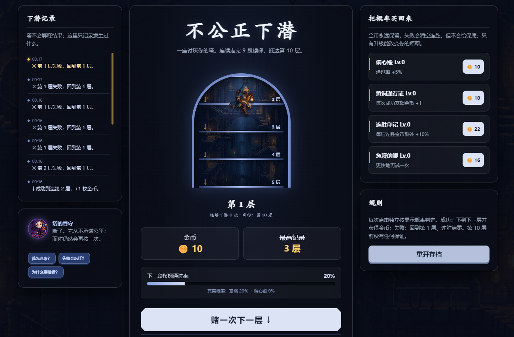

# 不公正下潜

一个以“低概率连续成功、失败重置、永久成长”为核心的单页玩法原型，用于快速验证重复尝试动机、概率信息表达和升级选择是否清晰。

## 玩法目标

玩家需要从第 1 层连续成功 9 次抵达第 10 层。每次点击都会进行独立概率判定：

- 成功：进入下一层并获得金币。
- 失败：回到第 1 层，但保留金币和永久升级。
- 成长：使用金币提高成功率、基础收益、连胜收益或操作容错。

## 原型验证内容

- 初始通过率为 20%，每级增加 5%，最高显示 99%。
- 失败会清空本轮楼层进度，但不会清除永久资源。
- 下潜记录、楼层进度、真实概率和永久升级同时呈现。
- 事件文本用于放大“差一点成功”的情绪，同时明确展示概率规则。

## 我的工作

- 确定玩法假设、通关条件、概率成长和经济结构。
- 设计失败重置与永久成长之间的重复尝试循环。
- 负责试玩判断，记录首次升级耗时、不同通过率阶段的推进速度和反馈强度。
- 使用 AI 快速搭建网页实现和整理文本，由我提出需求、判断方案并完成测试迭代。

## 在线运行

直接打开 `index.html` 即可运行，无需安装依赖或构建工具。

## 文件说明

- `index.html`：完整单页原型。
- `不公正下潜-策划案.md`：玩法规则、参数和验证目标。
- `preview.png`：当前原型界面截图。

## 项目边界

这是一天内完成的 AI 辅助玩法验证原型，用于展示从规则假设到可运行验证的过程，不作为完整商业游戏呈现。

